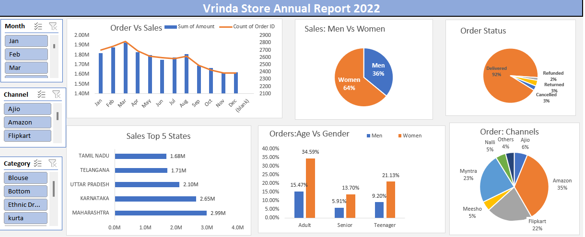

# Vrinda Store Annual Sales Report 2022 (with Excel)

##  Table of Contents
1. [Project Overview](#project-overview)
2. [Project Outline](#project-outline)
3. [Key Deliverables](#key-deliverables)
4. [Questions Answered in the Analysis](#questions-answered-in-the-analysis)
5. [Data Preparation & Processing](#data-preparation--processing)
   - [Data Cleaning](#data-cleaning)
   - [Data Processing](#data-processing)
6. [Interactive Dashboard](#interactive-dashboard)
7. [File Links](#file-links)
8. [Insights & Recommendations](#insights--recommendations)
9. [Conclusion](#conclusion)

---

## Project Overview
This project aims to analyze the annual sales performance of Vrinda Store (2022) and provide key insights into customer behavior, sales trends, and growth opportunities for 2023.

I used Excel to clean and process the data, created an interactive dashboard, and analyzed multiple aspects of the business, such as sales channels, demographics, and order status.

---

## Project Outline
- **Introduction**
- **Data Collection & Cleaning**
- **Data Processing**
- **Data Analysis**
- **Interactive Dashboard Creation**
- **Key Insights & Recommendations**
- **Conclusion**

---

## Key Deliverables
- A detailed **Annual Sales Report** for 2022  
- An **Interactive Dashboard** to visualize key sales metrics  
- **Recommendations** for sales growth in 2023  

---

## Questions Answered in the Analysis:

 - Comparison of Sales vs Orders  
  - Identification of the Month with Highest Sales 
 - Analysis of Customer Demographics (Men vs Women) 
- Breakdown of Order Statuses (Delivered, Refunded, etc.) 
- Top 5 States contributing to sales**  **Relationship between Age, Gender, and Sales
- Identification of Best Performing Sales Channel**  
- Most Profitable Product Categories**  

---

## Data Preparation & Processing

### Data Cleaning
- Standardized the **Gender Column** (m → Male, f → Female)  
- Replaced column inconsistencies (one → 1, two → 2)  
- Checked for **empty cells and errors**  

### Data Processing
- Created an **Age Group** column (Senior, Adult, Teenager)  
- Extracted **Month** from the Date column using:
  ```excel
  =TEXT(G2,"mmmm")
   ```
# Built Pivot Tables for key metrics:

- Order vs Sales (Line Chart)
- Men vs Women Sales (Pie Chart)
- Order Status Breakdown (Pie Chart)
- Top 5 States by Sales (Bar Chart)
- Age & Gender Breakdown (Column Chart)
- Sales Channels (Pie Chart)
- Added Interactive Slicers for filtering by Month, Channels, and Category.

## Interactive Dashboard




###  File Links:
- **Excel Analysis File**: [Download Vrinda Store Data Analysis Dashboard.xlsx](Vrinda%20Store%20Data%20Analysis%20dashboard.xlsx)
- **Raw Data File**: [Download SalesDataset raw data.csv](SalesDataset%20raw%20data.csv)

## Insights & Recommendations

## 1 Sales & Orders Analysis
- Sales peaked in March, reaching nearly 1.9M in revenue.
- Sales started strong in Q1 but gradually declined towards Q4.

Recommendation:

- Increase promotional campaigns in the last quarter to boost sales in slower months.

## 2 Customer Demographics: Men vs Women

- Women contributed 64% of total sales, while men contributed 36%.

Recommendation:

- Invest in targeted marketing campaigns for women’s fashion.
 - Offer special promotions and discounts on female-preferred products.
 - 
## 3 Order Status Breakdown

- 92% of orders were delivered successfully,
  while:
3% were canceled

2% were refunded

3% were returned

Recommendation:

- Improve order fulfillment processes to reduce return rates.

- Investigate reasons for cancellations to improve customer retention.
  
## 4 Sales by State

The Top 5 contributing states were:

Maharashtra – 2.99M

Karnataka – 2.65M

Uttar Pradesh – 2.10M

Telangana – 1.71M

Tamil Nadu – 1.68M

Recommendation:

- Expand inventory and delivery services in high-performing states.
- Launch localized marketing campaigns for Maharashtra and Karnataka.

## 5 Age Group & Gender Analysis
- Adults (34.59%) were the highest spenders.
- Teenagers (21.13%) were more likely to buy, especially women.

Recommendation:

- Focus marketing efforts on the adult age group with personalized deals.
- Target teenage buyers with trendy product launches.
  
## 6 Best Performing Sales Channels

Amazon (35%) was the top-performing platform, followed by:

Flipkart (22%)

Myntra (23%)

Recommendation:

- Strengthen partnerships with Amazon & Flipkart for more visibility.
 
-  Optimize pricing & promotions on Flipkart to increase conversions.
  
## Final Recommendations
- Expand Marketing for Women & Teenagers – Since women drive 64% of sales, focus on fashion, accessories, and personal care categories.

- Strengthen Amazon & Flipkart Sales – These platforms contribute 57% of total sales, so maximize ad spending there.

- Improve Logistics & Customer Service – Reduce returns & cancellations to increase profit margins.

- Leverage Seasonal Sales Trends – March saw peak sales; replicate successful strategies from this period in other months.

- Boost Sales in High-Performing States – Maharashtra, Karnataka, and Uttar Pradesh contribute over 60% of revenue; focus on regional discounts & promotions.

## Conclusion

The Vrinda Store 2022 Annual Sales Report provides valuable insights into sales performance, customer demographics, and regional demand.

The interactive dashboard enables real-time filtering and analysis, making it easier for decision-makers to optimize sales strategies.

By implementing these recommendations, Vrinda Store can drive higher sales growth in 2023, improve customer satisfaction, and increase overall profitability. 
